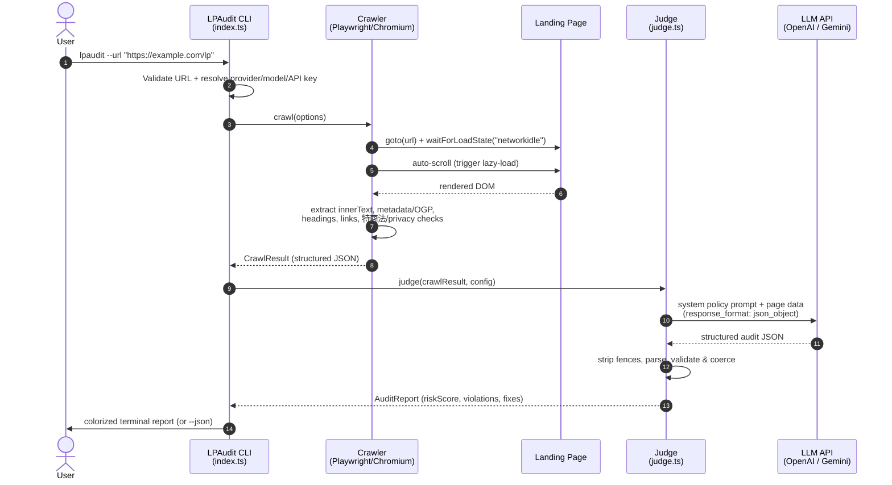

<div align="center">

# 🛡️ LPAudit

### Stop getting your ad accounts banned. Audit your landing pages *before* the platforms do.

**LPAudit** crawls any advertising landing page with a real headless browser, then runs the extracted copy and structure through an LLM guided by a detailed policy prompt covering the *common* rejection patterns of **Meta**, **Google**, and **TikTok** — plus Japanese consumer law (特定商取引法 / 景品表示法 / 薬機法). It returns a single **1–100 ban-risk estimate**, the **flagged sentences**, and **suggested fixes**.

> ℹ️ LPAudit is a heuristic *early-warning* tool. The risk score is an LLM-generated estimate based on a policy prompt — not an official ruling from any ad platform, and not legal advice. Always confirm against the current official policy centers. See the [disclaimer](#-disclaimer).

[](#-license)
[](https://nodejs.org)
[](https://www.typescriptlang.org/)
[](https://playwright.dev)

</div>

---

## ⚡ Why a "good" landing page still gets your account banned

Ad platforms don't just review your **creative** — they crawl your **destination URL**. A single non-compliant sentence on your LP can trigger:

- 🚫 **Ad disapproval** — your campaign never spends.
- ⛔ **Account suspension** — your *entire* ad account is frozen, often with no warning and a near-impossible appeals process.
- 💸 **Business Manager bans** — every page and pixel you own goes down with it.

The most common landing-page reasons accounts get nuked:

| Category | Real-world trigger examples |
| --- | --- |
| **Exaggerated / absolute claims** | "No.1", "100% guaranteed", "必ず痩せる", "月収100万円保証" |
| **Misleading design** | Fake countdowns, fake system warnings, hidden subscription terms (定期購入の不明瞭な表示) |
| **Restricted verticals** | Health/supplement disease claims (薬機法), crypto / 暗号資産, "get rich quick", MLM |
| **Missing legal elements** | No 特定商取引法に基づく表記, no Privacy Policy, no operator/company info |
| **Deceptive offers** | 優良誤認 / 有利誤認 under 景品表示法, undisclosed #PR/advertising |

You usually find out **after** the ban. LPAudit tells you **before** you spend a yen.

---

## 🎬 What it looks like

```text
━━━━━━━━━━━━━━━━━━━━━━━━━━━━━━━━━━━━━━━━━━━━━━━━━━━━━━━━━━━━━━━━━━━━━━━━━━━━━━━━
  LPAudit — Ad-Compliance & Account-Ban Risk Report
━━━━━━━━━━━━━━━━━━━━━━━━━━━━━━━━━━━━━━━━━━━━━━━━━━━━━━━━━━━━━━━━━━━━━━━━━━━━━━━━

Target URL   : https://example.com/lp
HTTP status  : 200
Page title   : たった30日で-15kg！誰でも必ず痩せる魔法のサプリ

  OVERALL RISK    87/100    SEVERE
  ████████████████████████████████████░░░░

Summary
  This page makes guaranteed weight-loss and disease-related claims that
  violate 薬機法 and Meta/Google health policies, uses absolute language,
  and is missing a 特定商取引法 notice. Very high disapproval/ban risk.

Policy Violations (4)

  #01 ■ CRITICAL · restricted_health  Meta  Google  Legal
      quote : “誰でも必ず痩せる” “30日で-15kgを保証”
      why   : Guaranteed medical/weight-loss outcomes are prohibited and
              violate 薬機法 efficacy rules.
      fix   : Replace with non-guaranteed, individual-results language and
              remove disease/efficacy claims.
  ...
```

---

## 🚀 10-second Quick Start

```bash
# 1. Install
npm install -g lpaudit          # installs Chromium automatically

# 2. Provide an API key (OpenAI or Gemini)
export OPENAI_API_KEY="sk-..."  # or: export GEMINI_API_KEY="..."

# 3. Audit any landing page
lpaudit --url "https://example.com/lp"
```

That's it. No config files, no setup wizard.

### Use Gemini instead

```bash
export GEMINI_API_KEY="..."
lpaudit --url "https://example.com/lp" --provider gemini --model gemini-1.5-flash
```

### Run it from source

```bash
git clone https://github.com/NagaYu/lpaudit.git
cd lpaudit
npm install
npm run dev -- --url "https://example.com/lp" --verbose
```

---

## 🧠 How it works

LPAudit is a two-stage pipeline: a **deterministic crawler** that never hallucinates the facts, feeding an **LLM judge** that applies policy reasoning.



**Stage 1 — Crawl (`src/crawler.ts`)**
Launches a hardened Chromium context, navigates with `domcontentloaded` → `networkidle`, **auto-scrolls** to trigger lazy-loaded sections, then extracts inner text, `<head>` metadata + Open Graph, headings, deduplicated links (footer-flagged), and runs **deterministic checks** for required legal elements (特定商取引法, Privacy Policy, 会社概要, etc.).

**Stage 2 — Judge (`src/judge.ts`)**
Sends the structured page data to your chosen LLM with a system prompt encoding **common Meta / Google / TikTok policy patterns** and **Japanese consumer-law requirements**. The model is forced into **JSON mode**; the response is defensively parsed, validated, and coerced into a strict `AuditReport`. Because the judgement comes from an LLM following a prompt, treat the output as a prioritized review checklist rather than a definitive verdict.

---

## 🛠️ CLI Reference

```text
Usage: lpaudit --url <url> [options]

Options:
  -u, --url <url>            landing-page URL to audit (http/https)   [required]
  -p, --provider <provider>  LLM provider: "openai" or "gemini"       [openai]
  -m, --model <model>        model id (default: gpt-4o-mini / gemini-1.5-flash)
  -t, --timeout <ms>         navigation/render timeout in ms          [45000]
      --headful              run the browser with a visible window
      --screenshot           capture & save a full-page screenshot
      --json                 emit machine-readable JSON only
  -o, --output-json <file>   also write the full raw JSON report to a file
  -v, --verbose              verbose diagnostic logging to stderr
  -V, --version              output the version number
  -h, --help                 display help
```

### Environment variables

| Variable | Purpose |
| --- | --- |
| `OPENAI_API_KEY` | Required when `--provider openai` |
| `GEMINI_API_KEY` | Required when `--provider gemini` (also accepts `GOOGLE_API_KEY`) |
| `OPENAI_BASE_URL` / `GEMINI_BASE_URL` | Override base URL (proxies / gateways) |
| `LPAUDIT_PROVIDER` | Default provider when `--provider` is omitted |
| `LPAUDIT_MODEL` | Default model when `--model` is omitted |
| `LPAUDIT_FAIL_OVER` | `riskScore` at/above which exit code is `2` (default `60`) |

### Exit codes (CI-friendly)

| Code | Meaning |
| --- | --- |
| `0` | Audit completed, risk below the fail-over threshold |
| `1` | Fatal error (bad URL, missing API key, crawl/judge failure) |
| `2` | Audit completed **but** `riskScore ≥ LPAUDIT_FAIL_OVER` — gate your pipeline on this |

```yaml
# Example: block a deploy if the LP is high-risk
- run: lpaudit --url "$LP_URL" --json -o lp-report.json
  env:
    OPENAI_API_KEY: ${{ secrets.OPENAI_API_KEY }}
    LPAUDIT_FAIL_OVER: "60"
```

---

## 📦 The audit JSON contract

`--json` / `--output-json` emit a stable, typed object:

```jsonc
{
  "crawl": {
    "finalUrl": "https://example.com/lp",
    "statusCode": 200,
    "metadata": { "title": "...", "openGraph": { "...": "..." } },
    "legalElements": [{ "key": "tokushoho", "present": false, "severity": "critical" }]
  },
  "report": {
    "riskScore": 87,
    "riskLevel": "severe",
    "summary": "…",
    "violations": [
      {
        "category": "restricted_health",
        "platform": ["meta", "google", "legal"],
        "severity": "critical",
        "quote": "誰でも必ず痩せる",
        "explanation": "…",
        "suggestion": "…"
      }
    ],
    "detectedCategories": ["healthcare"],
    "recommendations": ["…"]
  }
}
```

---

## 🧩 Project structure

```text
lpaudit/
├── src/
│   ├── types.ts          # Strict shared types & error class
│   ├── crawler.ts        # Playwright crawler + legal-element detection
│   ├── judge.ts          # LLM policy judge (OpenAI / Gemini) + JSON validation
│   ├── judge.test.ts     # Unit tests for parsing / coercion / risk bands
│   └── index.ts          # Commander CLI + colorized report formatter
├── .github/workflows/
│   └── ci.yml            # Type-check + tests + build on Node 18/20/22
├── package.json
├── tsconfig.json
├── tsup.config.ts
├── vitest.config.ts
├── README.md
├── LICENSE
└── .gitignore
```

---

## ✅ Testing

```bash
npm test            # run unit tests once (network-free, fast)
npm run test:watch  # watch mode
npm run typecheck   # strict TypeScript, no emit
```

The unit suite covers the brittle parts of the pipeline — stripping markdown
fences and extracting balanced JSON from messy model output, coercing partial
or malformed reports into a valid `AuditReport`, and deriving risk bands. CI
runs type-check, tests, and build on Node 18, 20, and 22.

---

## ⚠️ Disclaimer

LPAudit is an **assistive QA tool**, not legal advice and not an official ruling from any ad platform. Policies change frequently and enforcement is discretionary. Always confirm against the latest official policy centers (Meta, Google Ads, TikTok) and consult qualified counsel for legal compliance (特商法 / 景表法 / 薬機法).

---

## 🤝 Contributing

PRs welcome — new legal-element detectors, additional providers, and policy-prompt refinements are especially appreciated. Run `npm run typecheck` before submitting.

---

## 📄 License

[MIT](LICENSE) © LPAudit contributors

> If LPAudit saved your ad account, **drop a ⭐ on the repo** — it genuinely helps other marketers find it.
